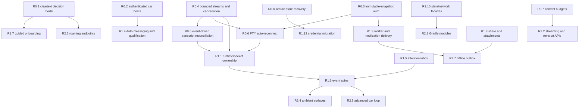

# Talaria roadmap

Current released version: **`0.9.2`** (2026-08-14). Current compatibility baseline: Hermes Agent `v0.19.1` unless a feature performs explicit capability discovery. Talaria remains an Android-first Kotlin + Compose client for remote-capable Hermes chat and management workflows; Electron-only local-window, tray, local-shell, and novelty-overlay behavior is not a parity target.

This roadmap is based on the public reviews under `review-reports/` plus the verified repository release history. It supersedes the completed v0.6 backlog as the forward implementation plan.

## How to read and change this roadmap

Priority means implementation order, not marketing importance:

- **P0 — now:** security boundaries, correctness bugs, primary-chat reliability, and small changes with outsized value.
- **P1 — next:** high-value cross-layer work once the P0 foundations are safe.
- **P2 — later:** structural programs, backend-assisted optimization, and additive product surfaces.
- **Not planned:** superseded, unsupported, unsafe, or poor-return work.

Value and effort are normalized across the reports:

- **Value:** Critical = release authorization/credential/data-loss or broken advertised path; High = primary workflow or major battery/memory win; Medium = meaningful product/maintainability gain; Low = niche/speculative.
- **Effort:** **S** = up to about three engineer-days; **M** = roughly four to ten engineer-days including tests; **L** = three or more engineer-weeks or coordinated backend/module work. `M/L` means an M client mitigation exists while the ideal protocol solution is L.

Every item has an ID and explicit dependencies. Re-prioritize freely within a tier when dependencies remain satisfied. Do not move an item ahead of its prerequisite in the graph; do not demote P0 authorization, credential-scope, or data-integrity work based only on low observed frequency. Server-assisted P2 items may move earlier when the API is already available and versioned. Every implementation should carry its acceptance test in the same change rather than creating a detached testing phase.

Public review abbreviations used below: **CQ** = `improvements.md`, **IDEAS** = `ideas.md`, **COMPAT** = `compatibility.md`, **SEC** = `security.md`, **PERF** = `performance.md`, **TEST** = `testing.md`.

## Released

The forward plan must not erase shipped work. These are the repository’s current release claims.

### v0.6.0 — API and UX breadth

- Managed file upload/download/mkdir/delete/media preview; plugins and Kanban; Telegram/WhatsApp onboarding; MCP editing; memory provider setup/OAuth; computer-use and terminal backends; deep toolset/model controls; update/drain and operations depth.
- Composer references, find-in-session, message edit/branch, syntax-highlighted Markdown, session pins/compaction, and progressive disclosure across Manage.
- Release trust narrowed to system CAs, with user-installed CAs debug-only; dead pre-Android-O guards removed; ViewModel and feature tests expanded.

### v0.7.0 — session continuity

- Auto-open active sessions created outside the current phone flow, source-aware session tabs, end-reason tracking, and transcript filtering for tool/system-only messages.

### v0.8.0 — car, foldable, voice, performance, and audit remediation

- Android Auto/templated car surface and AAOS experimentation, driving-safe agent creation, PTY prompt delivery fixes, Car API metadata fixes, and foldable/large-screen dual-pane chat.
- Server STT as the primary dictation path with Android fallback, bounded voice payload/lifecycle handling, and broader localization/transport tests.
- Audit remediation across multi-profile transport safety, chat/session ownership, PiP/deep links, artifacts/files, System/Config/Manage, car lifecycle, release lint, and default versioning.
- Performance fixes already retained: in-flight assistant state separated from immutable lines, Markdown parsing memoized, identical REST transcript state suppressed at the Compose boundary, stable lazy-list keys, and instant keyed auto-follow.

### v0.8.1 — artifact recursion hotfix

- Added a bound for recursively stringified JSON unwrapping after the artifact extraction stack-overflow regression. Structural depth/node/byte budgets remain forward work under R0.7.

### v0.8.2 — car host compatibility change, with known security debt

- Allowed all car hosts in release to work around sample-allowlist/OEM incompatibility. This shipped behavior is preserved as history, not endorsed as the target posture; R0.2 replaces it with authenticated release trust.

### v0.8.3 — Android Auto capability discovery

- Added `com.google.android.gms.car.application` metadata and `automotive_app_desc.xml` declaring both `notification` and `template`. The descriptor is shipped; it is not a forward backlog item.

### v0.9.0 — 2026-08-06

- One-tap token fetch from the dashboard, connection-doctor REST probe, explicit refresh on delayed live updates, multi-item share intake, local session labels/groups/favorites, transcript deletion + reconciliation, widget/car strings in all five locales, draft debounce + mic-off-screen, and Android Auto consent E2E.
- Fixes for the fetch-token main-thread hang, REST/WS token divergence, pasted-token crash loop, and `super.onCreate()` ordering on Auto hosts.

### v0.9.1 — 2026-08-12

- Audit remediation waves 0–5: transport ingress bounds, profile-scoped drafts/rebinding, serialized config saves, share/Kanban reliability fixes, hardened deep links and FileProvider paths, bounded version arithmetic, and cleartext-consent disclosure.
- Emulator loopback interceptor release-gated; repository cache invalidation keyed consistently; status widget cache race fixed; download retry fixed.

### Current verification baseline

- 214 unit tests are green by the supplied v0.8.3 baseline.
- The app remains one `:app` module at roughly 48k production lines.
- GitHub’s signed APK workflow runs unit tests and release assembly on version tags/manual dispatch. It is not yet a PR quality gate and does not run the instrumentation suite.

## Dependency graph

The graph captures hard sequencing, not every useful relationship. For example, tests land with each node, while R0.11 supplies the shared CI machinery.

## P0 — now

### R0.1 — Cleartext consent, legacy migration, and private-route support

**Why / value:** **Critical.** New physical-device HTTP LAN profiles cannot record the required consent, legacy profiles missing the field deserialize as approved, and Tailscale CGNAT `100.64.0.0/10` is rejected despite the advertised LAN/Tailscale workflow. This is both a broken connection path and a confidentiality boundary. Sources: **COMPAT, SEC, TEST**.

**Effort:** **M**. **Dependencies:** none; must precede R1.7 and R2.3.

**How:**

- Change the persisted `allowCleartext` default from true to false/undecided and add a versioned migration. Auto-approve only loopback, `127.0.0.0/8`, `::1`, and emulator `10.0.2.2`.
- Extend literal-address classification to RFC1918 IPv4, `100.64.0.0/10`, IPv6 ULA `fc00::/7`, and IPv6 link-local `fe80::/10`. Continue rejecting public HTTP, malformed literals, embedded credentials, arbitrary DNS names as private proof, and redirects that cross the approved origin.
- Add an explicit warning sheet showing the exact origin and consequences; store the decision per connection; show a persistent “HTTP — local network traffic is unencrypted” badge and a revoke action.
- Force consent false when the URL becomes HTTPS or the approved origin changes. Route save, doctor, password bootstrap, OIDC, REST, and WebSocket clients through the same policy.

**Key files / API and UX sketch:** `domain/model/ConnectionProfile.kt`; `core/network/ConnectionSnapshot.kt`, `CleartextPolicyInterceptor.kt`; `core/data/repo/ConnectionRepository.kt`; `feature/connection/ConnectViewModel.kt`, `ConnectScreen.kt`; migration fixtures. The connection button becomes “Review HTTP risk” before “Save and connect” for a verified private literal.

**Acceptance test:** Table-test all range boundaries and spoof-like hosts; a new RFC1918/CGNAT/ULA origin needs one explicit approval and then survives restart; revocation blocks the next request; missing-field legacy data is undecided; HTTPS never prompts; public HTTP and origin-changing redirects have no override.

### R0.2 — Authenticate release car hosts; allow all only in debug

**Why / value:** **Critical.** The exported service currently accepts any installed app as a car host, exposing recent conversations and prompt/create actions. The v0.8.3 descriptor improves discovery but does not authenticate callers. Sources: **COMPAT, SEC, TEST**.

**Effort:** **M**. **Dependencies:** none for caller policy; R0.3 also secures accepted-host transport.

**How:**

- Return `ALLOW_ALL_HOSTS_VALIDATOR` only for debug/DHU builds with the debug application ID.
- In release, begin with AndroidX known hosts and a maintained, provenance-documented package + signing-certificate SHA-256 table for verified Google/AOSP/OEM hosts. Never trust package name alone.
- Add phone-side observed-host enrollment/revocation for sideload/OEM compatibility. Default it off; display package, certificate fingerprint, and warning on the handset. Before enrollment, expose no transcript and no send/create action.
- Require recent handset confirmation for high-risk create/send controls when the host is manually enrolled; record the host identity used for each action.

**Key files / API and UX sketch:** `car/TalariaCarService.kt`, `CarSessionsRepository.kt`, `SessionListScreen.kt`; `AndroidManifest.xml`; `app/build.gradle.kts`; a small encrypted host-trust store and a You → Car hosts screen.

**Acceptance test:** Known verified hosts pass; unknown, debug-signed, rotated-unapproved, and fake hosts fail closed; fake host gets no transcript/callback; enrollment is explicit and revocable; debug DHU still works; release policy is locked by unit/instrumentation tests.

### R0.3 — Bind OIDC, workers, car, REST, and WebSocket auth to one immutable snapshot

**Why / value:** **Critical.** OIDC token exchange, `ReplyWorker`, and car PTY delivery can capture server A but later read mutable active-profile B credentials or tickets. Sources: **SEC, COMPAT, TEST**.

**Effort:** **M**. **Dependencies:** none; finish before R0.6 retries mint tickets.

**How:**

- Make `WsAuthHelper` accept a mandatory `ConnectionSnapshot`; remove no-argument active-profile reads from operation paths.
- Capture one snapshot at operation start and derive URL, REST client, WebSocket client, ticket/token discovery, management profile, and persistence from it.
- Key `auth_required` discovery by complete transport scope—connection ID, normalized origin, auth mode/provider, management profile—or keep it inside the snapshot client bundle. Invalidate atomically on edits/token changes.
- Add an `AuthInterceptor` origin guard: scheme, canonical host, and effective port must match before attaching any secret. Cancel if the saved snapshot changes or disappears.

**Key files / API and UX sketch:** `core/network/WsAuthHelper.kt`, `HermesClientFactory.kt`, `AuthInterceptor.kt`, `NativeOidcLogin.kt`, `ConnectionSnapshot.kt`; `worker/ReplyWorker.kt`; `car/CarSessionsRepository.kt`; `ConnectionRepository.kt`. No visible new control is needed; errors should say the saved connection changed and the operation was safely canceled.

**Acceptance test:** Deterministically switch A→B during each OIDC/worker/car stage for every auth mode. No B secret/ticket reaches A; a request either completes entirely under captured A or fails closed. Absolute cross-origin URLs receive no authorization header. Editing a saved profile gated↔ungated invalidates discovery.

### R0.4 — Bound WebSocket ingress, PTY frames, answer buffers, and preserve cancellation

**Why / value:** **High.** An unlimited event channel, uncapped live-answer builders, complete-message frame conversion, and cancellation-swallowing `runCatching` permit burst-driven OOM, stale work, and misleading errors. Sources: **CQ, SEC, PERF, TEST**.

**Effort:** **M**. **Dependencies:** none; required before R1.1/R1.6 consolidation.

**How:**

- Introduce a cancellation-transparent suspend-result helper that always rethrows `CancellationException`; mechanically migrate repository/ViewModel call sites and broad catches.
- Replace `Channel.UNLIMITED` with measured bounded ingress. Never drop prompt, completion, connection, or request-boundary events; conflate/drop old status, catalog, tool-progress, and token deltas. Reduce replay to the real startup contract.
- Define maximum text/binary PTY message size and close with WebSocket 1009 before binary UTF-8 conversion/ANSI/UI work. Bound ANSI pending state.
- Cap PTY and sidecar answer buffers by bytes/characters, retain a diagnostic tail, and represent truncation visibly. Add drop/high-water diagnostics without recording sensitive payloads.

**Key files / API and UX sketch:** `core/network/HermesEventClient.kt`, `PtyWebSocketSession.kt`; `core/util/AnsiStripper.kt`; `core/data/repo/HermesRepository.kt`; `feature/chat/ChatViewModel.kt`; `feature/terminal/TerminalOutput.kt`. Truncated streams display a compact “Earlier live output omitted; full history remains on server” marker.

**Acceptance test:** Sustained and oversized text/binary bursts stay within configured heap/queue limits; critical events preserve order; replaceable events coalesce; oversized frames close 1009; cancellation publishes neither late state nor “connection failed”; buffer limits and drop counters have deterministic tests.

### R0.5 — Event-driven, lifecycle-aware transcript/session reconciliation with atomic Room writes

**Why / value:** **High, highest combined performance return.** Every open tab can fetch the full transcript every 2.5 seconds outside visible lifecycle and rewrite all Room messages even when unchanged. Session refresh also fails to delete stale rows, and message replacement is not transactional. Sources: **PERF, COMPAT, CQ, TEST**.

**Effort:** **M** client-side; optional backend revisions belong to R2.2. **Dependencies:** R0.4 event bounds.

**How:**

- Parse `sessions.changed` and use session/message completion, detected event gaps, tab selection, and foreground resume as dirty signals.
- Retain one adaptive fallback only for the active, visible, working tab: immediate refresh, 2.5 seconds only while events are unhealthy/working, then 15–60 second backoff and stop. Cancel below `Lifecycle.State.STARTED`.
- Compare server revision/message count/hash before mapping or writing. Suppress unchanged Room work, not merely equal Compose publication.
- Add `@Transaction replaceSessionMessages`; add per-session delete/reconciliation so delete/prune/server removal cannot leave ghosts. Preserve last-good data on request failure.
- Lifecycle-gate the 30-second profile registry loop, refresh selected/visible profile first, cap per-profile concurrency, and skip semantically equal state publication.

**Key files / API and UX sketch:** `core/network/HermesEventClient.kt`, `ProfileRegistry.kt`; `feature/chat/ChatViewModel.kt`, `ChatScreen.kt`; `core/data/repo/HermesRepository.kt`; `core/data/db/Daos.kt`; `ui/components/PollEffect.kt`. A subtle “Live updates delayed; reconciling…” status replaces invisible aggressive polling.

**Acceptance test:** Five tabs produce zero transcript/profile polling while backgrounded and no inactive-tab polling; one completion produces one scoped refresh; unchanged payload produces zero DAO writes; delete/prune removes Room rows; failure between replacement steps cannot expose empty partial cache; resume refreshes immediately.

### R0.6 — Automatic, generation-safe PTY recovery

**Why / value:** **High.** Sidecars automatically reconnect but the authoritative PTY remains disconnected after an in-foreground failure, leaving a half-live tab. Sources: **PERF, TEST** and the known v0.8.3 baseline.

**Effort:** **M**. **Dependencies:** R0.3, R0.4, R0.5.

**How:**

- Extract a reusable transport supervisor with bounded jittered backoff, stability reset, terminal close-code classification, and a fresh ticket for each attempt.
- Preserve durable tab/session identity; resume/attach rather than create; keep sidecar progress visible; associate each socket with a generation and reject sends/callbacks from stale generations.
- After retry exhaustion, reconcile through the REST transcript and show a single clear retry action. Authentication/not-found/policy close codes should stop rather than loop.
- Keep user-initiated delivery idempotency separate from transport reconnection so a reconnect never resends an already accepted prompt.

**Key files / API and UX sketch:** `core/network/PtyWebSocketSession.kt`, `HermesEventClient.kt`, `WsAuthHelper.kt`, `PtyPromptDelivery.kt`; `feature/chat/ChatViewModel.kt`. Tab state becomes Connected → Recovering (attempt/backoff) → Reconciled/Retry.

**Acceptance test:** Drop PTY mid-turn with sidecars alive: the tab remints auth, resumes once, preserves output/session, and sends no duplicate prompt. Stale socket cannot accept input. 4401/4403/4404/4408 stop appropriately. Exhaustion produces a final transcript and working manual retry.

### R0.7 — End-to-end budgets for artifacts, image previews, and untrusted content

**Why / value:** **High.** Artifact traversal still resets structural depth and lacks node/byte/candidate budgets; file/artifact images decode full resolution synchronously in composition and retain encoded + decoded forms. Sources: **CQ, SEC, PERF, TEST**.

**Effort:** **M**. **Dependencies:** none; R2.2 is the ideal server-assisted follow-up.

**How:**

- Carry monotonically increasing depth through strings, arrays, and objects; cap input bytes, structural depth, nodes, candidates, and nested decode attempts; prefer iterative traversal.
- Run extraction/sorting on `Dispatchers.Default`; extract each session within its semaphore permit, merge incrementally, and discard full transcript responses immediately. Cache extraction by session revision when available.
- Probe bitmap bounds off-main, reject excessive decoded pixels, sample to display size, use lifecycle-aware cache eviction/hardware bitmaps where valid, and stop storing data URLs in Compose state.
- Lower client attachment peak by re-encoding/downscaling and sending one bounded image at a time until R2.2 adds streaming handles.

**Key files / API and UX sketch:** `feature/manage/artifacts/ArtifactExtraction.kt`, `ArtifactsViewModel.kt`, `ArtifactsScreen.kt`; `feature/manage/files/FilesViewModel.kt`, `FilesScreen.kt`; `feature/chat/ChatImageAttachments.kt`, `ChatViewModel.kt`. Rejected previews show dimensions/size and a safe download alternative.

**Acceptance test:** Depth 16/17, deeply structural JSON, alternating stringified containers, node/byte overflow, decompression-bomb dimensions, canceled previews, and 50-session scans terminate within budget without main-thread decode, stack overflow, ANR, or retained oversized data URLs.

### R0.8 — Typed secure-store failure recovery

**Why / value:** **High.** Profile/secret decode failure silently becomes an empty connection list or empty credentials, masking recoverable corruption and encouraging overwrite. Sources: **CQ, SEC, TEST**.

**Effort:** **M**. **Dependencies:** none; R1.12 builds on this state model.

**How:**

- Model `Available`, `RecoverableCorruption`, and `PermanentKeystoreLoss`; preserve the raw encrypted preference and fail secrets closed.
- Show a dedicated recovery screen with non-secret diagnostics and exact consequences. Offer an explicit destructive reset only after confirmation; never auto-recreate empty state.
- If a non-secret connection-name inventory is retained to explain impact, version and integrity-protect it; never duplicate tokens/passwords outside the encrypted store.

**Key files / API and UX sketch:** `core/data/prefs/SecureConnectionStore.kt`; `TalariaApp.kt`; `di/AppContainer.kt`; `feature/connection/*`. Recovery UI offers Retry, Copy diagnostics, and Reset encrypted connections.

**Acceptance test:** Corrupt profile JSON, corrupt secret ciphertext, and invalidated Keystore reach distinct states; no request uses an empty credential fallback; reset clears only documented state; existing healthy encrypted preferences survive upgrade/readback unchanged.

### R0.9 — Own and bound backup/debug/cache files

**Why / value:** **High for S/M effort.** System backup downloads can overlap, stream unbounded data, leave partial files, and bypass the managed share-file TTL. Sources: **CQ, PERF, TEST**.

**Effort:** **S/M**. **Dependencies:** reuse existing `ShareFileManager`.

**How:** Keep one download job/generation; enforce content-length and streamed byte limits; delete partial files on all failure/cancel paths; route successful backup/debug output into `ShareFileManager`; enforce TTL/count/weight cleanup; consume UI state without prematurely deleting a chooser-owned file.

**Key files / API and UX sketch:** `feature/manage/system/SystemViewModel.kt`; `feature/manage/files/ShareFileManager.kt`; System tests. System shows size/progress and “replaced by newer download” rather than racing results.

**Acceptance test:** Duplicate taps create one current job; oversized/canceled/failed copies leave no file; success remains shareable for policy TTL and then expires; stale completion cannot replace newer state.

### R0.10 — Close remaining low-effort correctness and release-integrity gaps

**Why / value:** **High aggregate value for S effort.** These are independent small defects: stale profile choices after connection change, overlapping Cron/Kanban mutations, incorrect CI-signing report, implicit Voice link gap, mic feature filtering, car-doc drift, duplicate config helper, and personal local path literals. Sources: **CQ, COMPAT, SEC, TEST**.

**Effort:** **S** as a tracked bundle; each subchange remains independently reviewable. **Dependencies:** none.

**How / files:**

- Clear `hermesNames` on connection-key change and show refresh failure: `ui/components/ProfileSwitcherBar.kt`.
- Serialize/reject `CronViewModel.mutate`; generation-guard/cancel Kanban refresh and mutations: `feature/manage/cron/*`, `feature/manage/kanban/*`.
- Report `useCiSigning || local keystore` and selected config: `app/build.gradle.kts`.
- Add `android:host="voice"` and declare microphone optional: `AndroidManifest.xml`.
- Correct min-car technical docs, replace personal paths with neutral examples, and remove test-only `updateConfigKey` after tests use the runtime reducer.

**Acceptance test:** Late A response never appears on B; duplicate mutation invokes at most one call; CI-signed release reports signed; implicit `talaria://voice` resolves; mic-less devices remain eligible; source search finds no personal production path; runtime tests cover the actual config reducer.

### R0.11 — Unsigned PR validation and P0 regression harness

**Why / value:** **High.** The 214 tests run only on tag/manual release; car has zero coverage, workers lack success-path tests, Compose has no behavior tests, and orchestration remains singleton/private. Sources: **TEST**, with required cases from every other review.

**Effort:** **M**. **Dependencies:** tests land alongside R0.1–R0.10.

**How:**

- Add a PR/branch workflow needing no signing secrets: unit tests, Android Lint, release-like compile/manifest checks, coverage report, and uploaded failures. Keep signed tag publishing separate.
- Extract injectable seams for PTY delivery, session synchronizer/owner registry/clock/poll delay, workers, car repository/validator, snapshot clients, and secure store.
- Use `StandardTestDispatcher` and virtual time for races; add timeouts to every blocking MockWebServer `takeRequest`; isolate temp folders/shared preferences.
- Add a small managed-device shard for merged manifest/network security, car/notification, and Compose smoke. Broader test gates continue in R1.13.

**Key files / API and UX sketch:** `.github/workflows/validation.yml`; Gradle coverage/lint config; `app/src/test/**`; `app/src/androidTest/**`. No user-facing UI.

**Acceptance test:** A PR breaking cleartext consent, auth scope, PTY retry/ack, car host policy, transcript lifecycle, parser limits, or Room transaction fails without access to a signing secret; lint/test reports upload on failure; network tests cannot hang indefinitely.

## P1 — next

### R1.1 — One lifecycle owner per channel and lazy active-tab restoration

**Why / value:** **High.** Chat, process observer, and foreground service can duplicate sockets; cold start eagerly opens PTY + two sidecars and history for every restored tab; off-screen runtimes keep working. Sources: **PERF, COMPAT, CQ, TEST**.

**Effort:** **L**, delivered in vertical slices. **Dependencies:** R0.4–R0.6.

**How:** Restore lightweight tab metadata immediately; hydrate only active tab; make inactive tabs dormant; close PTY/RPC when not needed; keep one foreground event subscriber; hand off to one turn-scoped foreground service only when process backgrounds; explicitly stop chat/terminal/recording producers below their lifecycle state. Preserve remote server work independently of local socket ownership.

**Key files / API and UX sketch:** `feature/chat/ChatViewModel.kt`, `ChatScreen.kt`; `feature/terminal/*`; `core/lifecycle/HermesForegroundObserver.kt`; `core/notifications/AgentTaskNotificationService.kt`; `ui/navigation/TalariaNavRoot.kt`. Dormant tabs show cached title/state and hydrate on selection.

**Acceptance test:** N restored tabs create one active runtime, not `3N`; foreground turn has one event subscriber; background handoff has no gap or duplicate notification; stop closes intended producers; selecting a dormant tab hydrates exactly once.

### R1.2 — Coalesced chat UI state and chunked terminal rendering

**Why / value:** **High.** Each PTY/sidecar frame copies large strings and broad tab/UI state; terminal measures one 120k-character node per frame and re-strips raw ANSI; rows repeat linear scans. Sources: **PERF, CQ**.

**Effort:** **M**. **Dependencies:** R0.4; benefits from R1.1.

**How:**

- Publish visible stream snapshots at most every display frame or 50–100 ms; publish no raw terminal delta to Compose while Reading mode hides it.
- Split composer, transcript, connection status, prompt, and session rail into narrower flows/state holders; guard no-op `working=true` copies.
- Precompute line-index and session-parent maps; derive search results/count in one pass.
- Use one stateful ANSI parser; store bounded chunks/lines in a ring; render a keyed `LazyColumn`; follow only when already at bottom.

**Key files / API and UX sketch:** `feature/chat/ChatViewModel.kt`, `ChatScreen.kt`, `SessionRailPane.kt`, `ChatTranscriptPolicy.kt`; `feature/terminal/*`; `core/util/AnsiStripper.kt`.

**Acceptance test:** High-rate stream yields equal final text with no split-escape corruption; no full-screen recomposition per token; terminal history position remains stable; p95/p99 and missed frames improve under a repeatable release-like stream test.

### R1.3 — Delivery-grade workers, notifications, and foreground watches

**Why / value:** **High.** User replies have no network constraint/expedited/idempotent contract; originating notifications can disappear before delivery; foreground start/time-limit failures are swallowed. Sources: **COMPAT, TEST, IDEAS**.

**Effort:** **M**. **Dependencies:** R0.3 and the attention state in R1.5 where available.

**How:** Add connected constraints, expedited user-initiated work with out-of-quota fallback, stable unique/idempotency keys, and accepted-frame no-retry semantics. Preserve delayed/failed status until acknowledgement. Make active-turn watch turn-scoped/resumable; surface `ForegroundServiceStartNotAllowedException` and Android 15 timeout/quota states. Skip background sync categories the user disabled and add explicit backoff.

**Key files / API and UX sketch:** `worker/ReplyWorker.kt`, `PairingApproveWorker.kt`, `HermesSyncWorker.kt`, `SyncScheduler.kt`; `core/notifications/NotificationActionReceiver.kt`, `AgentTaskNotificationService.kt`, `TalariaNotifier.kt`. Notifications show Queued/Delayed/Failed with safe retry rather than optimistic dismissal.

**Acceptance test:** Doze/offline reply delivers exactly once after connectivity; pre-accept failure retries while post-accept failure does not; permanent 4xx fails visibly; FGS start/quota failure updates UI; scope changes never retarget work.

### R1.4 — Complete Android Auto messaging and supported real-car qualification

**Why / value:** **High.** v0.8.3 fixed capability discovery, but messaging notifications lack `MessagingStyle` and mark-read, raw sideload is not a supported real-vehicle Car App Library distribution criterion, and route-loss/Doze behavior is unqualified. Sources: **COMPAT, TEST**.

**Effort:** **M** engineering plus device QA. **Dependencies:** R0.2, R0.3, R1.3.

**How:** Implement `NotificationCompat.MessagingStyle`, immutable content/mark-read intents, mutable reply intent, and stable conversation IDs aligned with car items. Test DHU first. Distribute the same signed build through Internal App Sharing or Internal/Closed testing for real vehicles. Cover Pixel, Samsung, OnePlus; touch/rotary; locked/cold/background; notification denial; battery saver/Doze; mobile/Wi-Fi/VPN route loss and recovery. Record host identity/version/certificate for trust maintenance.

**Key files / API and UX sketch:** `TalariaNotifier.kt`, `NotificationActionReceiver.kt`, workers; `car/*`; manifest/packaging assertions; release/testing docs and workflow. The phone notification and car conversation show the same reply/read state.

**Acceptance test:** Packaged descriptor has notification + template; DHU Car API 7 launches; trusted builds appear in the supported OEM matrix; reply/mark-read survive Doze/offline recovery; unknown host stays denied. Documentation states that raw GitHub/Obtainium sideload is DHU/emulator-only rather than promising unsupported real-car visibility.

### R1.5 — Durable Agent Attention Inbox

**Why / value:** **High.** Permission requests, clarifications, failures, completions, and expired prompts are too dependent on ephemeral notifications. Sources: **IDEAS, TEST**.

**Effort:** **M**. **Dependencies:** R0.3 fixed scope; define the data/action contract before R1.6.

**How:** Persist attention records keyed by connection/profile/session/request/instance with status, age, source, and allowlisted actions. Support answer/choice, approve once, deny, snooze, open, dismiss; keep sudo, secret, broad YOLO, and ambiguous actions phone-only or view-only. Notifications become projections of the same record; replay/update resolves idempotently.

**Key files / API and UX sketch:** new `feature/attention/*`; Room entities/DAO; `core/notifications/*`; `feature/activity/ActivityScreen.kt`; scoped action worker. Add an Attention destination/badge and filtered All / Needs me / Done views.

**Acceptance test:** Clearing a notification does not delete the inbox item; process death/profile switch preserves exact scope; replay creates one record; answering resolves the correct request once; expired/stale requests cannot execute; unsafe prompts expose no unsafe quick action.

### R1.6 — Bounded dashboard event spine with reconciliation fallback

**Why / value:** **High leverage.** Global/session state is split among per-tab sidecars, process observer, service, and polls. A shared state layer can power notifications, widgets, car, and boards consistently. Sources: **IDEAS, PERF, COMPAT**.

**Effort:** **M/L**, depending on dashboard-wide event support. **Dependencies:** R0.4/R0.5, R1.1, R1.5.

**How:** Normalize session created/working/needs-input/completed, tool, artifact, cron, and connection events into a process-scoped persisted store. Consume an advertised dashboard-wide stream when available and current channel sockets for detailed events. Maintain cursor/replay or idempotent IDs. Use lifecycle-aware conditional polling only to reconcile gaps/old servers.

**Key files / API and UX sketch:** new `core/events/*`; `HermesEventClient.kt`, `ProfileRegistry.kt`; `HermesForegroundObserver.kt`; `AgentTaskNotificationService.kt`; `HermesSyncWorker.kt`. Expose one read-only state API to UI/widget/car consumers.

**Acceptance test:** One server transition becomes one normalized scoped state across inbox/widget/car; replay is idempotent; dropped stream reconciles without losing completion; queue, persistence, socket, and polling counts stay within budgets.

### R1.7 — Guided onboarding driven by server and route capability

**Why / value:** **High.** The current connection screen is powerful but asks first-time users to choose protocol/auth details before server classification. Sources: **COMPAT, IDEAS**, building on the connection failure in R0.1.

**Effort:** **M**. **Dependencies:** R0.1.

**How:** Use staged progressive disclosure: explain client/server reachability → enter/classify URL → cleartext/TLS guidance → public then protected probe → show only supported auth modes → select management profile/provider setup → completion/doctor. Keep pins, raw tokens, save-without-test, advanced OIDC/provider controls, and diagnostic output behind Advanced. Persist navigation state, not unsubmitted secrets.

**Key files / API and UX sketch:** `feature/connection/ConnectScreen.kt`, `ConnectViewModel.kt`; capability/probe models in `core/network`; navigation/strings. Offer setup cards for Local emulator, Home LAN, Tailscale/VPN, and HTTPS without weakening policy.

**Acceptance test:** A novice can connect loopback, RFC1918, Tailscale, system-trusted HTTPS, password, session token, bearer, or OIDC without irrelevant controls; Advanced remains reachable; back/process restoration preserves stage; no secret persists before explicit save.

### R1.8 — Bounded Android share intake and general attachment pipeline

**Why / value:** **High.** Current intake handles one text or image despite existing file/preview infrastructure; multi-item shares and selected text should create a reliable scoped task. Sources: **IDEAS, TEST**.

**Effort:** **M**. **Dependencies:** R0.3; R2.7 adds offline sending later.

**How:**

- Add a dedicated lightweight capture activity/store for `ACTION_PROCESS_TEXT`, `ACTION_SEND`, `ACTION_SEND_MULTIPLE`, `ClipData`, subject/text/URL, images, PDFs, general documents, and bounded voice-note files.
- Copy grants into a managed cache with count/aggregate/per-item byte limits, MIME/signature checks, URI dedupe, TTL cleanup, and process-death persistence.
- Let the user choose current/pinned/new target session and add an instruction. URLs offer local suggestions such as summarize/compare/extract tasks.
- Use image RPC where supported; otherwise capability-gate managed upload and insert a safe server file reference. Never pretend unsupported arbitrary binary attachment semantics exist.

**Key files / API and UX sketch:** `AndroidManifest.xml`, `MainActivity.kt`; new `feature/capture/*` and cache store; `feature/chat/ChatImageAttachments.kt`, `ChatViewModel.kt`; `PtyPromptDelivery.kt`; managed files API. A bottom-sheet-style task composer shows ordered attachments, target, instruction, and Send/Save draft.

**Acceptance test:** Multi-image/PDF/text and selected-text actions preserve order, reject over-budget/spoofed input, survive process death, cannot be intercepted, never cross scope, and deliver once or retain a visible draft. Unsupported attachment type has an explicit upload/link alternative.

### R1.9 — Capability-gated session organization

**Why / value:** **Medium-high.** Talaria has strong bulk administration but needs better day-to-day grouping and archive workflows. Source: **TEST** coverage implications plus the required product direction for session organization.

**Effort:** **M**. **Dependencies:** capability discovery from R1.7; local grouping can begin independently.

**How:** Add local labels/groups, saved filters, and optional favorites alongside pins. Show a clear Local badge. Add archive/restore and server project/group move only if the connected dashboard advertises a versioned capability; otherwise hide the controls rather than probing speculative endpoints. Preserve bulk delete/prune/import/stats, branch/compact, and latest-descendant semantics.

**Key files / API and UX sketch:** `feature/manage/sessions/SessionAdminViewModel.kt`, `SessionsScreen.kt`, `SessionDetailScreen.kt`; Room entity/DAO; capability/API models. Sessions gets filter chips and a progressive-disclosure Organize action.

**Acceptance test:** Local labels/groups work offline and remain connection/profile scoped; supported archive/move round-trips; unsupported controls are absent; migration preserves pins; bulk operations respect filters without silently mutating hidden rows.

### R1.10 — Extract runtime, repository, and UI facades before modularization

**Why / value:** **High maintainability leverage.** `ChatViewModel`, `ChatScreen`, and `HermesApi` mix multiple state machines; several Composables own repositories and async state directly. Sources: **CQ, PERF, TEST**.

**Effort:** **L**, incremental. **Dependencies:** avoid destabilizing R0 transport fixes; can overlap late P1 work.

**How:** Introduce a connection-scoped `ChatRuntimeCoordinator` with child tab runtimes, generation IDs, resume/backoff, and dirty events. Extract transcript, voice, prompt, and notification collaborators. Move Config/Channels/Analytics request ownership into ViewModels with immutable `UiState`. Split `HermesApi` into feature Retrofit interfaces composed by the client factory. Hoist screen sections into stateless composables.

**Key files / API and UX sketch:** `feature/chat/ChatViewModel.kt`, `ChatScreen.kt`; `core/network/HermesApi.kt`, PTY/event clients; `core/data/repo/ChatRepository.kt`; Config/Channels/Analytics screens; `di/AppContainer.kt`. UX should remain unchanged; this is the seam required for tests/modules.

**Acceptance test:** Runtime recovery/poll tests no longer instantiate the 2.8k-line ViewModel; key screens survive recreation through ViewModel state; feature Retrofit contracts remain wire-compatible; no Composable reaches the global app container in migrated areas.

### R1.11 — Finish localization and responsive surface coverage

**Why / value:** **Medium.** Catalogs exist, but substantial English literals remain in Manage/car/widget/manifest surfaces. Sources: **CQ, COMPAT**.

**Effort:** **M**. **Dependencies:** preferably after R1.7/R1.8 copy settles; CI check can land now.

**How:** Move every user-visible literal into resources; add a CI check for missing translations/new display literals; complete current Japanese, Simplified/Traditional Chinese, and Arabic catalogs; add pseudolocale, RTL, and 200% font review. Then expand based on demand, initially Spanish, French, German, Brazilian Portuguese, and Korean. Add responsive quick-widget layouts with localized labels and smaller safe size modes.

**Key files / API and UX sketch:** `res/values*/strings*.xml`; connection/chat/Manage/car/widget screens; `LocaleManager.kt`; lint config and widget XML/Glance layouts.

**Acceptance test:** Lint/translation completeness passes; representative source/manifest/widget searches find no inline display strings; current locales are complete; RTL/200% font work on compact, rail, and car-safe surfaces; widget remains usable on narrow OEM grids.

### R1.12 — Version and migrate credential persistence; add supply-chain evidence

**Why / value:** **Medium-high security assurance.** Credentials still depend on old/deprecated `security-crypto:1.1.0-alpha06`; no resolved release SBOM/lock evidence is retained. Sources: **CQ, SEC**.

**Effort:** **M** for persistence plus **S/M** CI supply-chain work. **Dependencies:** R0.8.

**How:** Isolate a versioned credential persistence interface; move to stable 1.1.0 only as a tested bridge if useful; implement a direct Keystore-backed AES-GCM envelope with associated data/versioning and atomic rollback/readback. Generate resolved release dependency lock/SBOM, scan for exploitable High/Critical issues, retain results with APK checksums/signing provenance, and review Android security notes.

**Key files / API and UX sketch:** `SecureConnectionStore.kt`; new persistence abstraction; version catalog/Gradle; migration fixtures; release workflow. No normal UX change; failures route to R0.8 recovery.

**Acceptance test:** Fixtures from every released format migrate without lost secrets; interrupted migration leaves old or complete new state readable; corrupt data opens recovery; new installs do not use alpha crypto APIs; release publishes verifiable SBOM/checksum/scan evidence.

### R1.13 — Broader orchestration, UI, and performance gates

**Why / value:** **Medium-high.** Unit vocabulary is broad but repository, worker, car, notification, navigation, widget, Compose, and tail-performance behavior remain shallow. Sources: **TEST, PERF**.

**Effort:** **M**. **Dependencies:** R0.11.

**How:**

- Add `HermesRepository` + MockWebServer integration for scope/cache/error/cancellation/concurrency; WorkManager/boot/scheduler tests; car repository/screen controller; voice lifecycle; notification service/receiver; widget/tile; every manifest deep link.
- Add Compose smoke/behavior for Chat, Connect, Voice and one happy path per high-risk management surface; compact/expanded, semantics, restoration, permission/error states.
- Add managed devices at API 29 and target API. Add Kover/JaCoCo reporting and a pragmatic changed-lines signal rather than brittle whole-project percentage theater.
- Add Macrobenchmark cold start/chat scroll, Perfetto/FrameTimeline high-rate PTY stream, allocation profiling, Room write trace, and Battery Historian one-vs-five-tab scenarios. Track p95/p99/missed frames, heap high-water, requests, writes, and battery—not p50 alone.

**Key files / API and UX sketch:** test/benchmark modules or source sets, Gradle configs, `.github/workflows/*`, `app/src/test`, `app/src/androidTest`.

**Acceptance test:** Nightly/PR reports are reproducible and uploaded; a wiring break in car/worker/navigation/Compose is detected; documented cold-start, p95/p99, heap, Room-write, and background-request budgets fail the appropriate gate without making the fast unit lane unusable.

### R1.14 — Focused startup, cache, file, draft, voice, and tile performance pass

**Why / value:** **Medium-high aggregate.** After the P0 hot path, remaining costs include per-keystroke Room writes, unbounded response cache, duplicate/cancel-less file work, eager TTS/container startup, background audio, profile fan-out, and inaccurate tile state. Sources: **PERF, COMPAT, CQ**.

**Effort:** **M** across independently shippable slices. **Dependencies:** R0.5/R1.1 avoid lifecycle overlap.

**How:** Debounce draft persistence 300–500 ms with `mapLatest/distinctUntilChanged`, flush on send/stop; weighted LRU and expired-entry removal; remove duplicate initial Files listing and generation-cancel previews; paginate/cache large directories; lazy TTS and noncritical container/work/channel initialization after first draw; six-way profile semaphore + timeouts; stop STT/recording on `ON_STOP`; accurate QS `UNAVAILABLE/INACTIVE/ACTIVE`; category-aware background sync/backoff.

**Key files / API and UX sketch:** `ChatViewModel.kt`, `ChatRepository.kt`; `ResponseCache.kt`; `FilesViewModel.kt`, `FilesScreen.kt`; `TalariaApp.kt`, `AppContainer.kt`, `TtsSpeaker.kt`; `ProfileRegistry.kt`; `TalariaTileService.kt`; sync worker.

**Acceptance test:** Typing creates at most one write per debounce window plus send/stop flush; cache obeys weight/TTL; closed preview has no late work; TTS is unbound when disabled; startup metrics improve; microphone stops off-screen; tile reports real availability; no draft/data regression.

## P2 — later

### R2.1 — Enforce Gradle module boundaries

**Why / value:** **Medium-high long-term velocity.** Package naming does not stop feature code reaching the global graph, and every change invalidates one large module. Source: **CQ**, supported by **TEST/PERF** coupling findings.

**Effort:** **L**. **Dependencies:** R1.10 stable facades; do not perform a big-bang move.

**How:** Stage `core:model`, `core:network`, `core:data`; then high-change `feature:chat`, `feature:manage`, `feature:voice`, and shared `feature:car`; keep `:app` as composition/navigation/manifest root. Define allowed dependency direction and deliberate resource/API DTO boundaries. Move one vertical slice at a time with build/test measurements.

**Key files / API and UX sketch:** `settings.gradle.kts`, root/module Gradle files, `di/AppContainer.kt`, package moves. No UX change.

**Acceptance test:** Module graph is acyclic/enforced; migrated features cannot access the app container directly; focused module tests/builds run independently; clean/release build time and APK behavior do not regress.

### R2.2 — Server-assisted streaming attachments, transcript revisions, and artifact index

**Why / value:** **Medium-high scalability.** Base64 image RPC can exceed 90 MiB peak heap; artifact refresh performs up to 51 full-history requests; polling cannot be truly cheap without revisions. Source: **PERF**.

**Effort:** **L** client + Hermes dashboard. **Dependencies:** R0.7 client budgets remain the compatibility floor.

**How:** Add multipart/chunked attachment upload returning handles; server/proxy message limits; incremental transcript endpoint with revision/ETag/after cursor; session summaries with message/artifact revision; artifact index/metadata endpoint. Keep old-server paths behind strict caps.

**Key files / API and UX sketch:** dashboard API plus feature Retrofit interfaces, repository models, chat attachments, artifact/files UI. Upload shows streaming progress and cancel; transcript/artifacts refresh only changed data.

**Acceptance test:** Large supported attachment streams with bounded client heap; incremental refresh transfers/writes only changes; artifact screen avoids N+1 histories; old server remains functional within client limits and clearly reports unsupported streaming.

### R2.3 — Approved multi-endpoint roaming and narrow private trust

**Why / value:** **Medium.** A logical Hermes home may have LAN, VPN/Tailscale, and fallback origins, but today users manually edit one URL. Sources: **IDEAS, COMPAT**.

**Effort:** **M/L**. **Dependencies:** R0.1, R0.3, R1.7.

**How:** Store an ordered list of independently approved origins under one logical connection; probe only those origins on network change; prefer verified local route when present; fail over without changing management/profile identity; display active transport. Never auto-enable cleartext or probe arbitrary hosts. Optionally add narrowly scoped per-profile CA material and current+backup SPKI pins with explicit rotation; never globally trust user CAs.

**Key files / API and UX sketch:** `ConnectionProfile.kt`, secure store, `ConnectionSnapshot.kt`, client factory, connection settings and background monitor. Connection card shows Home LAN / VPN / Offline and lets users reorder/test/revoke origins.

**Acceptance test:** LAN→VPN→offline→VPN chooses only approved origins, keeps scope, and never sends a secret cross-origin; active HTTP/TLS/pin state is visible; route failure cannot silently fall back to public cleartext; pin rotation works with overlap.

### R2.4 — Ambient agent board, contextual shortcuts, and mobile cron recipes

**Why / value:** **Medium-high visible product value.** The launcher should show agents needing attention, not only server status; frequently used sessions/actions should be one tap; Cron should sell outcomes rather than raw schedules. Source: **IDEAS**.

**Effort:** **M** per slice. **Dependencies:** R1.5/R1.6.

**How:** Build a resize-aware Glance board with up to three agents and needs-input count; publish dynamic shortcuts for relevant/pinned sessions, Talk, and one safe pinned action; add recipes for morning brief, commute digest, build watch, memory summary, weekly cost. All consume shared event/attention state and existing cron APIs—no new pollers.

**Key files / API and UX sketch:** widgets/XML, new shortcut publisher, `ProfileRegistry`/event store, cron screens/models, routes/settings. Compact widget shows aggregate; larger layouts show scoped rows and safe actions.

**Acceptance test:** Widget/shortcuts show exact scoped state from cache/live store, deep-link correctly, adapt to launcher size, and create no independent high-frequency socket/poll; recipe previews schedule/prompt/delivery before creation.

### R2.5 — Deliverable Inbox

**Why / value:** **Medium-high.** Artifacts should appear as agent deliveries rather than requiring a manual Manage → Artifacts rescan. Source: **IDEAS**.

**Effort:** **M**. **Dependencies:** R1.5/R1.6 and R0.7 safe extraction.

**How:** On completion, resolve artifact/file references into a durable delivery record with producer, session, kind/MIME, size, preview, download/share, and ask-for-revision. Notify once with the best next action. Keep delivery state separate from full transcript and reuse managed file/artifact preview/cache paths.

**Key files / API and UX sketch:** artifacts extraction/ViewModel/screen, Room, notifications, Activity/Attention, routes, changed-files card. Add Deliveries filter/timeline and exact artifact deep links.

**Acceptance test:** One completion/replay creates one delivery; preview obeys budgets; offline cached metadata remains useful; download/share links exact scope; ask-for-revision targets source session; missing/deleted artifact degrades visibly.

### R2.6 — Capability-gated Kanban, memory, code-brief, and MCP action integrations

**Why / value:** **Medium/niche.** Existing administration can become a mobile workflow layer without moving tool credentials/policy into Talaria. Source: **IDEAS**.

**Effort:** **M** each. **Dependencies:** R1.6, capability discovery, R2.7 when offline guarantees are offered.

**How:**

- “Start agent” from a Kanban task, store explicit session association, show worker/attention/artifact state, and propose—not force—status changes.
- Review-before-write memory capture from selected text/share/voice/completion and sourced recall into composer.
- Agent-mediated compact code impact brief with definition/callers/callees/tests/artifact, not an IDE recreation.
- Schema-derived allowlisted MCP tool cards translated into structured agent prompts until Hermes exposes an authenticated generic invocation endpoint. Store no MCP secret locally.

**Key files / API and UX sketch:** Kanban, MCP, chat/capture, artifacts/review/files, routes/settings, PTY delivery. Each card previews target scope, parameters, side-effect level, and execution mode.

**Acceptance test:** Capability-absent controls are hidden; every action previews scope/side effects and links one exact session; replay is idempotent; no MCP credential is stored; agent-mediated mode is labeled accurately.

### R2.7 — Offline, scoped, exactly-once PTY outbox

**Why / value:** **Medium-high mobile reliability.** A busy-live queue exists, but route loss/process death can still lose captured prompts from chat/share/car. Source: **IDEAS**, supported by **TEST** delivery gaps.

**Effort:** **M**. **Dependencies:** R0.3, R0.6, R1.3; R1.8 supplies attachment handles.

**How:** Persist prompt, managed attachment handles, exact connection/profile/session, and idempotency key. Deliver with connected constrained/expedited work. Expose queued/sending/failed/sent, cancel/edit, and target-loss errors. Retry only before frame acceptance; never silently retarget to active profile.

**Key files / API and UX sketch:** Room; `PtyPromptDelivery.kt`; outbox/reply worker; chat/capture UI; notifications. Composer and Attention show an Outbox chip/list.

**Acceptance test:** Process death/route loss preserve queue; pre-accept failure retries; post-accept timeout does not duplicate; deleting target fails visibly; edit/cancel works before send; multi-attachment order remains stable.

### R2.8 — Continuous, road-safe car loop and phone handoff

**Why / value:** **Medium.** Car should become useful for a whole drive, but only after host trust, delivery, and notification qualification. Source: **IDEAS**.

**Effort:** **M/L**. **Dependencies:** R0.2/R0.3, R1.4–R1.6.

**How:** Add a concise voice loop—dictate, working, final spoken summary, reply/repeat/summarize/continue on phone. Surface only constrained clarification and low-risk approve-once/deny choices; keep sudo, secret, broad YOLO, destructive, and ambiguous actions phone-only. Add bounded user-owned quick starts, artifact summary/send-to-phone, and exact park-and-continue deep link.

**Key files / API and UX sketch:** `car/*`; attention/event models; voice; notifications/routes; settings/cron pin actions. The car screen remains within templated messaging constraints and renders no general file browser.

**Acceptance test:** Driving-restricted DHU never shows secrets/files/destructive controls; safe prompt answers target exact request; artifact handoff opens exact phone preview; voice loop recovers route loss without duplicate prompt; personal quick starts require confirmation for side effects.

### R2.9 — Hinge-aware foldable Agent Cockpit

**Why / value:** **Medium.** Current adaptation is width-only and can disagree with root window info or straddle a hinge. Sources: **COMPAT, IDEAS**.

**Effort:** **L**. **Dependencies:** R1.10 state-hoisted UI.

**How:** Use one `WindowAdaptiveInfo` source plus `WindowLayoutInfo/FoldingFeature`; choose two/three panes by width, height, and posture; place session board and conversation around separating hinge; contextual inspector switches among tools/subagents, changed files, artifact preview, and permission detail. Preserve two panes when three are cramped.

**Key files / API and UX sketch:** `TalariaNavRoot.kt`, `ChatScreen.kt`, session rail, subagent/changed-files/artifact components; window dependency if needed.

**Acceptance test:** Fold/unfold, tabletop, split-screen, desktop windowing, compact height, 200% font, and separating/occluding hinge keep transcript/composer/actions reachable with preserved state and no occlusion.

### R2.10 — Dedicated Android Automotive OS artifact

**Why / value:** **Medium but platform-specific.** The phone APK’s trampoline is not a compliant AAOS templated-app distribution artifact. Source: **COMPAT**.

**Effort:** **L**. **Dependencies:** R2.1 shared car module and completed car security/tests.

**How:** Create a minSdk 29 automotive artifact requiring `android.hardware.type.automotive` and `android.software.car.templates_host`; add `com.android.automotive` descriptor with `template`; make `CarAppActivity` launcher; provide independent connection setup/storage/network handling. Keep phone projection artifact separate and consider restoring phone minSdk 28 after `app-automotive` leaves it.

**Key files / API and UX sketch:** new automotive/shared-car modules, manifests/resources, Gradle settings/workflows. Embedded car gets its own safe setup path; no assumption that phone credentials transfer.

**Acceptance test:** AAOS emulator/target discovers the automotive artifact natively; phone artifact still projects; storage/network setup is independent; minSdk and feature filtering are correct for each artifact.

### R2.11 — Sideload trust center and stable/beta/canary/test lanes

**Why / value:** **Medium release maturity.** Users need provenance, and car/network changes need real-device testing without replacing the trusted daily install. Source: **IDEAS**, with trusted distribution need from **COMPAT**.

**Effort:** **M/L**. **Dependencies:** R0.10 signing accuracy, R0.11 CI, coordinate with R1.4.

**How:** Publish install docs/QR, checksum, release descriptor, and signing fingerprint for Obtainium users. Add About/Updates showing version/code/lane/API baseline/application ID/certificate/source/check status and safe downloaded-APK verification. Add `.beta`, `.canary`, `.test` IDs, labels/icons/signers/version streams; short-lived QA builds and redacted feedback bundle. Export profiles encrypted; exclude or separately protect secrets.

**Key files / API and UX sketch:** Gradle flavors, workflows, release docs/templates, new About/Updates screen, package/certificate helper, profile export/import.

**Acceptance test:** Stable identity upgrades continuously; lanes install side-by-side and cannot cross-update; checksum/certificate can be verified before installer; test builds expire and never enter stable feed; diagnostics contain no token/secret.

### R2.12 — Future Android local-network permission and TLS rotation readiness

**Why / value:** **Medium forward compatibility.** Target 36 local-network protection is forward-looking; one SPKI pin creates a rotation hazard; release correctly does not trust user CAs globally. Sources: **COMPAT, SEC**.

**Effort:** **S/M** when Android finalizes the contract; pin work **M**. **Dependencies:** R0.1/R2.3.

**How:** Test `RESTRICT_LOCAL_NETWORK` now; implement in-context permission only when the final enforced API is documented; explain denial and route users to VPN/TLS. Support ordered current+backup SPKI pins with overlap, rotation, and recovery. Add explicit sign-out that attempts remote/provider revocation, always clears local credentials/sockets, and reports remote outcome.

**Key files / API and UX sketch:** manifest/connection UI, certificate pin model/factory, connection repository, OIDC/logout, tests/docs.

**Acceptance test:** Local permission denial has a recoverable UX; no speculative permission is requested today; pin rotation succeeds through overlap and fails safely without it; sign-out clears local state even if remote revocation fails and reports that distinction.

## Not planned

These decisions prevent obsolete or unsafe work from re-entering the backlog.

### N1 — Re-add the Android Auto capability descriptor

Superseded by v0.8.3. Keep only a merged-release-manifest regression test.

### N2 — Use raw GitHub/Obtainium sideload visibility as the real-car pass criterion

Unsupported for Car App Library production qualification. Use DHU for sideloaded testing and Internal App Sharing/Internal or Closed testing for real vehicles unless Android changes policy.

### N3 — Keep `ALLOW_ALL_HOSTS_VALIDATOR` in release

Availability does not justify authorizing every installed host. Only debug/DHU may allow all; R0.2 is the release design.

### N4 — Globally trust user CAs, arbitrary “local” DNS names, or public cleartext

This weakens the origin boundary and invites DNS-rebinding/misconfiguration risk. Use explicit private literals/routes, system-trusted TLS, or narrowly scoped per-profile trust from R2.3/R2.12.

### N5 — Add frequent global WebSocket pings

No current client-ping battery drain exists. Socket ownership and polling are the real cost. Reconsider only if field data after R1.1 shows idle NAT closures, then use one conservative server-aligned interval.

### N6 — Begin with a big-bang module or cross-platform rewrite

Runtime seams, security, and tests come first. R1.10 extracts boundaries; R2.1 enforces them incrementally. Another platform requires separately funded product demand.

### N7 — Direct generic MCP invocation without a Hermes contract

Do not move tool credentials/policy into Talaria or invent endpoints. R2.6 remains explicitly agent-mediated until Hermes exposes a versioned, authenticated, auditable generic invocation API.

### N8 — F-Droid packaging before current release lanes mature

It adds a separate signing/update/reproducibility program with lower near-term return than security, reliability, and sideload trust. Reconsider after R2.11 and demonstrated demand.

### N9 — Optimize for p50 alone

Tail jank, missed frames, heap high-water, network requests, SQLite writes, and battery are the release metrics. R1.13 owns repeatable p95/p99 resource gates.

## Re-prioritization triggers

- A confirmed credential cross-scope event, fake-host exploit, silent store corruption, or cache data loss keeps the corresponding P0 at the top regardless of feature demand.
- Field evidence of PTY disconnects moves R0.6 immediately after R0.3/R0.4; it may not bypass those prerequisites.
- Image/artifact ANR/OOM reports move R0.7 ahead of performance polish, not ahead of release authorization/credential fixes.
- If a dashboard-wide replayable event API already exists, R1.6 may move earlier after R0.4/R0.5, but it must not introduce another unbounded queue or socket owner.
- Real-car demand accelerates R1.4 only after R0.2/R0.3; it does not justify restoring release allow-all.
- Backend staffing can pull R2.2 forward because it retires multiple client mitigations, but old-server bounded fallbacks remain mandatory.
- Module extraction moves earlier only when a P0/P1 change is blocked by current seams; use a vertical slice, not a repository-wide move.
- New feature work should consume the attention/event/capture/session facades rather than adding an independent poller, socket, global container lookup, or unbounded cache.
